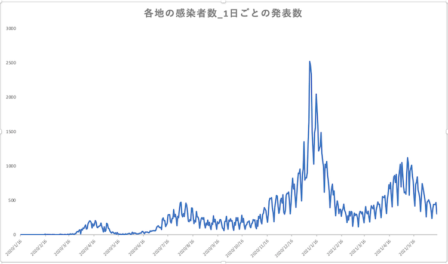
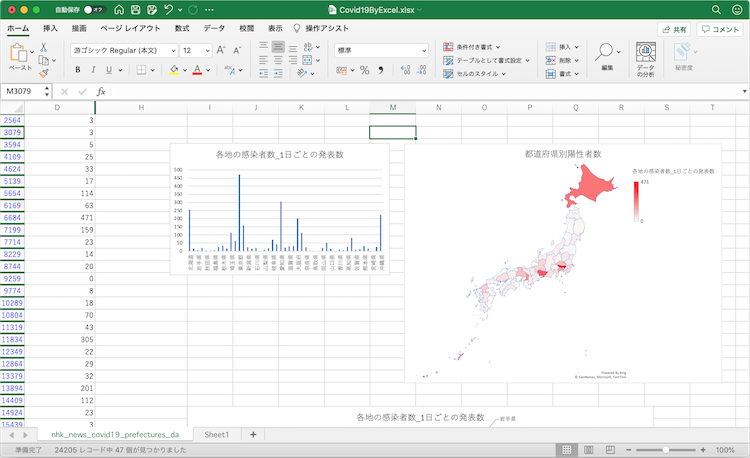

# Excelで可視化する新型コロナデータ
- 新型コロナのデータを使ってExcelで統計解析の基礎や可視化をやってみようという試み

## [参考] 元データの入手と加工
- 元データ
  - NHK 新型コロナウイルス特設サイト(https://www3.nhk.or.jp/news/special/coronavirus/data/)で配布されている各都道府県ごとの感染者数の推移データ(2021/6/14ダウンロード) ：[https://raw.githubusercontent.com/chalkless/lecture/master/biostats/covid19/nhk_news_covid19_prefectures_daily_data.csv](nhk_news_covid19_prefectures_daily_data.csv)
  - [愚痴] 厚労省とか内閣官房とかオープンデータとか言いながらろくなデータないし。都道府県別のデータだと累積データとか（それはここで毎日の陽性者数を計算する演習をしろってことですか）

## Excelでファイルを開く
- Excelを立ち上げる
- 今回はカンマ区切り（csv: comma separated value）なので、テキストファイル（Windowsでいうところのメモ帳で開くファイル。Excel形式でないもの）として読み込む
  - Windowsの場合：シートの上にファイルをドラッグ&ドロップすると開くようです。もしくは、ファイル > 開く から。CSVだと型式を気にせず読み込めると思いますが、ファイルの形式をExcel形式でなくカンマ区切りファイル（CSV）（もしくはテキストファイル）を選択するとファイルのリストに表示される（or 選択できるようになる）
  - Macの場合：ファイル > 開く から。もしくは ファイル > インポート > CSVファイル
- 読み込みのダイアログがでた場合：区切り記号付き → 区切り文字コンマなどと選びながら次へを押していく
- 文字化けしたとき：ファイル > インポート > CSVファイルと進み、テキストファイルウィザード画面で「元のファイル：Japanese (MacOS)」となっているところを「Unicode (UTF-8)」に変える。とプレビューで都道府県名が読めるようになる。
- 1つのセルに全部のデータが入ってしまった時：ファイル > インポート > CSVファイル > ファイルウィザード画面1 > ファイルウィザード画面2 と進み、フィールドの区切り文字指定でカンマだけにチェックを入れる。プレビュー欄で各データの間に縦線が入っているのを確認する。
- 無事に開ける
  - 
- **[ファイルの保存]** 何はともあれファイルの保存。ファイル > **名前をつけて保存でExcelブックとして保存**
  - 普通に（テキストファイルとして）保存してしまうと、関数やグラフが保存されないのでExcelブックの形式で保存する。

## グラフ作成・可視化の下準備
- 全体としては25000行程度のデータだが、今回は東京都の感染者の推移と最新の都道府県別の感染者の可視化を行う

### フィルター機能によるデータの絞り込み
- 大半は使わないデータなので、それを絞り込むためにフィルター機能を使う。
- ホームタブ > （場合によっては右の方の虫眼鏡マーク+編集の中の）並べ替えとフィルター > フィルターにチェックを入れる
- 1行目に▼印がつく
- 今回は日付、都道府県名、各地の感染者数_1日ごとの発表数の列だけを使うので他の列は非表示にしておくと便利。たとえば都道府県コードを表示しているB列の列ラベル（Bと書いてあるところ）で右クリックすると、表示しないと出るのでそこをクリックして選択する。逆に再表示させるときはA→Cとドラッグしたり、A列を選択後にShiftキーを押しながらC列を選択したりしたのち（ようするにBの前後の列を選択する）、右クリックから再表示を選択する。

## 陽性者数の推移の可視化
### 東京都での日ごとの陽性者数の推移
- 都道府県名の▼をクリックして東京都を選択する。（すべて選択を一度クリックしてすべてのチェックをはずしてから東京都を選ぶと便利）
- どこかデータのあるセルを選択して全選択（Win: Ctrl-A、Mac: ⌘+A）するとデータの部分がすべて選択されるので、とりあえずコピーし（Ctrl/⌘-C）、新しいシートを作成し（シート左下（この場合、nhk_news_covid19_prefectures_dataと書いてあるところ）の右の+マークをクリック）、データをコピーする。
- すべてが東京都のデータなので、都道府県名の列は非表示にする。
- グラフを描く：データを全選択して、挿入タブから好きなグラフを選ぶ。この場合は折れ線グラフか棒グラフがよいと思う。
- グラフがオブジェクトとして挿入されるので、大きさを変えたり、色を変えたりする。
-

### [応用] 7日間平均の推移
- 曜日によって検査数にムラがあるので、日ごとの推移は1週間を周期に小さい波を打つ。（ギザギザする）
- その影響をなくすために7日間の平均を記載する。
- 日ごとの陽性者数の隣の列に7日間の平均を計算する。
- ...（追記予定）

## 都道府県ごとの感染者数
- ...（追記予定）
- 

