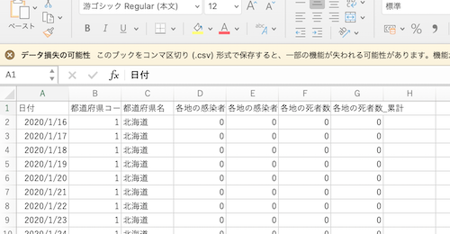

# Excelで可視化する新型コロナデータ
- 新型コロナのデータを使ってExcelで統計解析の基礎や可視化をやってみようという試み

## [参考] 元データの入手と加工
- 元データ
  - （内閣官房）新型コロナウイルス感染症対策 https://corona.go.jp/dashboard/
  - ここにある全国の感染者数データ（JSON形式）：https://opendata.corona.go.jp/api/Covid19JapanAll →[Covid19JapanAll.json](https://raw.githubusercontent.com/chalkless/lecture/master/biostats/covid19/Covid19JapanAll.json):2021年6月14日にダウンロードした元ファイル（ここでは使わない）
  - [参考] 最新の都道府県別累積陽性者数：https://data.corona.go.jp/converted-json/covid19japan-all.json
- [参考] データの加工
  - 元のファイルはJSON形式というのですが、Excelだと処理しにくいのでCSVに形式変更している
```
$ cat Covid19JapanAll.json | jq -r '.itemList[]|[.date, .name_jp, .npatients]|@csv'> Covid19JapanAll.csv
```
  - このCSV変換したファイルを使うのでダウンロードしておく。[Covid19JapanAll.csv](https://raw.githubusercontent.com/chalkless/lecture/master/biostats/covid19/Covid19JapanAll.csv)

## Excelでファイルを開く
### ファイルを開く
- Excelを立ち上げる
- 今回はカンマ区切り（csv: comma separated value）なので、テキストファイル（Windowsでいうところのメモ帳で開くファイル。Excel形式でないもの）として読み込む
  - Windowsの場合：シートの上にファイルをドラッグ&ドロップすると開くようです。もしくは、ファイル > 開く から。CSVだと型式を気にせず読み込めると思いますが、ファイルの形式をExcel形式でなくカンマ区切りファイル（CSV）（もしくはテキストファイル）を選択するとファイルのリストに表示される（or 選択できるようになる）
  - Macの場合：ファイル > 開く から。もしくは ファイル > インポート > CSVファイル
- 読み込みのダイアログがでた場合：区切り記号付き → 区切り文字コンマなどと選びながら次へを押していく
- 文字化けしたとき：ファイル > インポート > CSVファイルと進み、テキストファイルウィザード画面で「元のファイル：Japanese (MacOS)」となっているところを「Unicode (UTF-8)」に変える。とプレビューで都道府県名が読めるようになる。
- 1つのセルに全部のデータが入ってしまった時：ファイル > インポート > CSVファイル > ファイルウィザード画面1 > ファイルウィザード画面2 と進み、フィールドの区切り文字指定でカンマだけにチェックを入れる。プレビュー欄で各データの間に縦線が入っているのを確認する。
- 無事に開ける
  - 
  