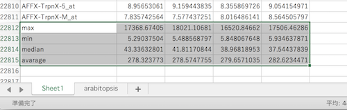
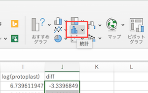
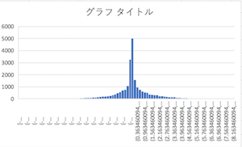
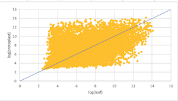

# Excel でなぞる遺伝子発現解析

普通はプログラミングかR言語でするような遺伝子発現解析を、Excelで試しに（できる部分だけ）やってみようという試み

## GEOからの遺伝子発現データの取得
- GEO (Gene Expression Omnibus) は、NCBIが集めている遺伝子発現のデータベース
  - もともとはマイクロアレイのデータベースだったがNGS（次世代シーケンサー）が出てきてRNA-Seqのデータもここに入ることになり、今は遺伝子発現データのデータベースとなっている。
  - てなわけで今はNGSデータの方がはやりなのだが、NGSデータの解析自体で1回の講義になってしまうレベルだし、コマンドラインや計算機リソースを駆使するような計算なので、今回はある程度そのあたりを計算済ということでマイクロアレイのデータを例とする。
- あらためまして、GEOのサイトにアクセスするのだが、今回は混乱を避けるために測定データセットを検索するサイトを示しておく。 https://www.ncbi.nlm.nih.gov/gds/
- 生物種名や生命現象を検索ボックスに入れて、どのようなデータがあるか楽しんでみましょう
  - 詳細まで見るといくつかのパターンがあることがわかります
    - 正常と疾患/変異株/薬剤処理など状態を2群間で比較するデータ
    - ある状態下でのさまざまな臓器など多サンプル間で比較するデータ
    - 薬剤処理後の時間経過ごと、発生ステージなどなどの時系列データ
- 今回は、GSE15515 ：Transcriptome Profiles of Differentiated arabidopsis Leaf Cells and Dedifferentiating Protoplasts of Ler and kyp mutant （シロイヌナズナ Ler および kyp 変異体における分化した葉細胞と脱分化したプロトプラストでのトランスクリプトーム [全遺伝子発現] プロファイル）を用いることとします。 https://www.ncbi.nlm.nih.gov/geo/query/acc.cgi?acc=GSE15515
- Samples の項目を見ると、どういうサンプル（試料・材料）を使って実験をしたかが書いてあります
  - 上の比較データか、時系列データか意識して、どれがセットか考えるといいでしょう
  - 場合によっては同じようなデータを何回もとっているものがあります。
    - 同じサンプルを何回か測定：technical replica。複数やることで実験操作を相殺する
    - 別個体で何回か測定：biological replica。複数やることで個体差を相殺する
- その下のところに実際の遺伝子発現データがダウンロードできる形で置いてあるが、単純な表にはなっていないので加工が必要（実験情報がくっついているので、そのままではExcelで開けない。いや開けるけど、頭とか末尾を削らないといけない）
  - SOFT formatted family file(s)
  - Series Matrix File(s)
- 今回はこのデータをもとに講義用に加工したデータ([GSE15515.for_lecture.txt](data/GSE15515.for_lecture.txt))を使って説明する。（のでダウンロードしておく）

## 解析の目標
- Arabidopsis（シロイヌナズナ）の葉とプロトプラスト（細胞壁を薬品的に除去した状態）でどんな機能の遺伝子が特異的に（=その状態のみで）働いているか?（または働いていないか?）

## 遺伝子発現データの統計的な解析
### ファイルを開く
- Excelを立ち上げる
- 今回はテキストファイル（Windowsでいうところのメモ帳で開くファイル。Excel形式でないもの）なので ファイル > 開く でなく、ファイル > インポート
- 今回はタブ区切り（tsv: tab separated value）なので、テキストファイルとして読み込む。
- 読み込みのダイアログが出る。区切り記号付き → 区切り文字 タブ などと選びながら次へを押していく
  - 各列のデータタイプで遺伝子名が書かれた列は標準でなく文字列を選ぶとOct4問題は回避できる
- 無事に開ける
- 今回はID_REF（プローブ名）, leaf1, leaf2, protoplast1, protoplast2 というデータ構成になっている。
- 2万行近くあるので、画面の分割をすると楽である。
  - どこか適当なセルを選択して 表示 > 分割
  - 線をドラッグすると分割場所を動かせる。端まで持って行くと分割解除
  - 下半分のウインドウのどこかのセルを選択し、スクロールバーをドラッグして末尾へ。
- **[ファイルの保存]** 何はともあれファイルの保存。ファイル > 名前をつけて保存 で Excelブックとして保存
  - 普通に（テキストファイルとして）保存してしまうと、関数やグラフが保存されない

### データの分布を調べてみる
- データの列には遺伝子の発現量が数値で入っている
  - GEOに登録してあるのは対数値なのですが、Excelで対数をとる演習のために今回はわざわざ数値を元に戻しています
- ちらちら眺めると0に近い値から数千まで数値があるような
- そこで、各列の一番下の行で最大値と最小値を計算してみましょう
  - 一番下のデータの次の行あたりでセルを選択して
  - 最大値を例に：`=max(`まで入力すると、範囲を聞かれるので、上ウインドウでB2（一番上）をクリックし、Shiftを押しながら下ウインドウでB22811をクリック。Enterを押すと`)`が勝手に補完されて計算される。
  - 同様に最小値 `=min(...)`も
- 続けて、中央値（median）と平均値も計算してみる
- 1列分計算できたので、計算結果を複数セル選択し、右下をドラッグして数式をコピーする
- 結果が出る
  - 
- 考察：左2列がleaf、右2列がprotoplast。これからその2列どうしの数値の平均をとるが、特に中央値や平均値が大きくずれていないので、2列のデータの分布はほぼ同じそうだと期待でき、特に補正（正規化という）をせずに先に進むこととする。（というか実際はすでに補正済のデータが登録されていたのだろう）

### 2つの状態での発現量を比較する
- 左2列のleaf、右2列のprotoplastをそれぞれ2回実験をしたとみなして、誤差を補正するために平均をとることとする。
- D列（protoplastの左側の列）のどこかのセルをクリックしてからC列とD列の間に空の列を挿入する（ホーム >挿入の∨記号（かそれに類するもの）> シートの列を挿入）
- 一番上に ave(leaf) なり適当にラベルを振っておく
- とりあえず一番上のデータでleafの2データの平均をとる
  - `=average(` とうって、B2セルをクリック。その後、コンマを入力してC2を選択するか、shift+C2をクリックか、でEnter
- 全データで平均値をとる。今 計算したセル（D2）を選択してコピー。ペーストしたいセルとしてまずはD3をクリック。shiftキーを押しながら下ウインドウのD22811をクリックしてペースト。計算結果が出ればOK
- 同様にprotoplastも各データの平均値を計算する
- 発現量データの対数をとる。この場合は今 計算した平均値に対して対数を計算する。
  - 上の方で最大値、最小値を計算した際にわかるように、ケタが4桁近く違うので、数値を扱いやすくするのだと思ってくれ
  - とはいえ、このあと2状態の発現「比」を計算するので、その時点でだいぶケタの範囲が小さくなる気もするが
- 平均を計算した右列に対数を計算する列を挿入する。今回はE列のどこかを選択しておいて、列を挿入
- 一番上に、log(leaf) などと適当にラベルをつけておく
- 対数を計算する。`=log(`とうつと`=log([数値],[底])`と関数の書式を教えてくれるので、数値として平均値のD2をクリック、カンマを打って、底として2を入力する
  - 別に底は2でも10でもいいのだが、マイクロアレイの解析の時は、伝統的に「発現比2倍以上」というデータの絞り込みをしていたため、わかりやすくするために底は2を用いている。（というか、そういうこともわかりやすくするために対数をとるのである）
- 同様に下まで関数をコピーする。のち、protoplastの方も対数の計算をしておく。
- このあたりで、最初からあった生データはすでに平均をとってしまい振り返らなくてもよくなったので非表示にする。B列、C列と（少なくともC列は）shiftキーを押しながらクリックし、列の上で右クリックして非表示を選ぶ。
  - 参考までに、元に戻す時は、隣接する2列（この場合はA列とD列）を選んで右クリックすると再表示メニューが出てくる。
- 発現比を計算する。
- **今回やりたいのは、元のデータが何倍の発現量差があるかなので、対数の比をとるのでなく、比をとった後で対数をとる**
  - 覚えていますか：log(A/B) = log(A) - log(B)
  - とりあえずラベルをつける。J1にdiffとか書いておく
  - 一番右のJ列で`=` → E2（log(leaf)) をクリック → `-` → I2（log(protoplast)）をクリック → Enter
  - `=log(E2)-log(I2)`という計算が出来上がっているはず
- 計算を全行分コピーして実行

### 発現量比較のデータを眺めてみる
- diff 列のデータの意味を振り返ってみる
  - `diff = 2` ：log(diff)=2 だから2^2で4倍の発現差がある。この場合、leafの発現が高い
  - `diff = -2`：log(diff)=-2 だから1/(2^2)で1/4倍の発現差がある。この場合、leafの発現が1/4だから、protoplastの方が4倍発現が高い
  - `diff = 0`：log(diff)=0 ということ。つまり、2^0=1。ようするに、leafとprotoplastで発現量が同じということ
- 試しに diff 列について、`max`, `min`, `average`, `median` を計算してみる
  - 特にaverage、medianはほぼ0のはず。（というか、元の分布がそうなるようにすでに補正してあるわけである）
- 実際のデータの分布がどんなかヒストグラムを描いて確認してみる
- diff 列のデータ部分を選択して、挿入タブ > （グラフの中の）統計 を選ぶ
  - 
- ヒストグラムを選択すると、グラフが描画される
  - 
  - 0 を中心に左右対称になっている
  - （もう少し横幅を狭めたいのだが、Excelでできるのかどうか調べてできたら追記することとする）
- 実際のデータで分布がどうなっているかも散布図 (scatter plot) で確認することとする
- とりあえず（グラフを描くのに操作が煩雑になるので）平均の列を非表示にする（この場合、D列とH列）
- diffを取る前の、2つのlog列を選択して、挿入タブ > 散布図 > 散布図
  - 
- 散布図 (scatter plot) が描画される
  - 
  - この図は加工済（軸ラベルを足した。青線を足した）
- 散布図 (scatter plot) を眺めてみる
  - 青線は y=x の線。つまり、log(leaf)=log(protoplast)で、ようするに発現が変動していない遺伝子はこの上に載りますということ。
  - 青線から離れるほど、発現が変わっている
  - 下に離れるとleafで発現が大きい、上に離れるとprotoplastで大きい

## 発現に差のある遺伝子の機能解析
- **覚えていますか**：[解析の目標] Arabidopsis（シロイヌナズナ）の葉とプロトプラスト（細胞壁を薬品的に除去した状態）でどんな機能の遺伝子が特異的に（=その状態のみで）働いているか?（または働いていないか?）

### 発現に差のあるデータの絞り込み
- protoplastで発現の高い遺伝子のみを抽出してみる。今回は試しに8倍以上にしてみる
  - 8 という数字は適当です。
  - 適当というのは、まぁ、こんなもんかな、ってことです。
  - どうしてまぁ、こんなもんかなって思うかは、試しに絞り込んでみて、（全体が20000くらいに対して）いくつくらいに絞り込めるかとか、結果を見てみたらきれいになったとか、信頼度がどのくらいかとか、そういうので決めているだけで、統計的にかっちり基準があるわけではありません。
  - またあとでこのあたりは出てきます
- とりあえず、フィルターするとデータの個数が何個になるか気になるのでその用意をすることとする。
- A列一番下あたりに「# of data」とでも書いておく
  - \# は number の略。ようするにデータの個数ということ
- 関数名がわからないので「Excel フィルター 個数」などとググる
- と、どうやら`=subtotal(3,範囲名)`と書けばいいらしい
  - 3 は`counta`関数と同じく、空白でないセルの個数を返すという呪文らしい
- diffで絞り込むのでdiffの列にでも移動して`=subtotal(3,A2:A22811)`と書いておく（範囲指定は手打ちしなくてもこれまでやっている選択→shift+選択でまったくかまわない）
  - と22810と出れば成功
- ここからやっと絞り込み
- diffラベルのセルを選択して（別にどこでもいいのだが）ホームタブ > 並べ替えとフィルター > フィルター。すると、ラベル行の各セルに▼がつく
- diffラベルのセルで▼をクリックすると、どうフィルターするか出てくるので、「1つ選択してください」から「指定の値以上」で 3 (log(8)=3だから)と指定する
- としばらくExcelが考え、下半分のウインドウが真っ白なシートを表示するので、おちついてスクロールバーをドラッグして表示していあるところまで上にスクロール
- 何個 表示されているか確認
  - 900個かー。ちょっと多いなー。もう少し絞り込むかー
  - というわけで、対数で5（実データで32倍）くらいにしてみる
  - diffラベルの▼は電波の弱いガラケーアンテナのような形になっているが、再びそれをクリックし、3以上を5以上にする
  - 112個になった。
  - 今回はこのくらいで許してやろう

### 遺伝子機能解析
- ここから遺伝子機能解析を専門のサイトでやります。
- DAVIDでググる。と、DAVID Functional Annotation Bioinformatics Microarray Analysis というサイトが出てくる（はず）。クリックしてそのサイトに行く
  - ちなみに https://david.ncifcrf.gov/
  - DAVIDは（遺伝子機能による）エンリッチメント解析ということをやるサイトです。ランダムに選んだ遺伝子セットに対して、この遺伝子セットは顕著にこの機能が多いですね、みたいなものを可視化してくれます。
- タイトル下の Start Analysis をクリック
- 画面が切り替わり、左カラムに入力ボックスが現れる
- Excelに戻って、IDをコピーする
  - A列で（見た目で）2行目から一番下まで（max とか # of dataはいらない）をコピーする
  - DAVIDのPaste a listにペースト
- ペーストした下の方の Step 3 でGene Listを選ぶ
- Step 4でSubmit Listをポチる
- 左カラムでArabidopsisなどと出れば成功
  - 返ってこないときは、タイトル下にあるDevelopment siteの方に行ってから同じことをする
- Functional Annotation Toolをクリック
- 機能解析メニューが出てくる
- よく使うのは Gene Ontology
  - Ontologyというのは階層型の用語集
    - 階層型というのは 人体 > 泌尿器系 > 腎臓 > 糸球体 のようなこと
- 解析その1：GOTERM_CC_ALL の右のChartをクリック
  - CCは cellular component 。細胞内の場所、の意味
  - 今回は一番上に cell wall （細胞壁）が出てくる
  - もともとの2群の違いは細胞壁があるかないか
  - いいじゃないか
- 解析その2：GOTERM_MF_ALL の右のChartをクリック
  - MFは molecular function。直訳だと分子機能。遺伝子そのものの機能的な（次のbiological processとも似る）
  - 一番上は「xyloglucan:xyloglucosyl transferase activity」
  - xyloglucan とはなんぞ? ググる
  - Wikipedia に「双子葉植物の一次細胞壁には普遍的に含まれ、セルロースミクロフィブリル間を架橋している。」とある
  - transferase（転移酵素）は原子群の場所を移動させる酵素
  - いいじゃないか
- 解析その3：GOTERM_BP_ALL の右のChartをクリック
  - BPは biological process。Molecular Functionが集まって起きる何か、のようなもの
  - 一番上は「glucosinolate biosynthetic process」
  - glucosinolate とはなんぞ? ググる
  - Wikipediaには「グルコシノレート は、カラシナやキャベツ、ワサビなどの辛味をもつアブラナ目の多くに含まれる二次代謝産物の一種である。」とある。確かにArabidopsisはアブラナ科だ。。。なるほど
- その他
  - PathwayのEC番号（酵素番号）やKEGG Pathwayなどを眺めてみてもよい

### まとめと発展
- Excelで統計の手法で遺伝子を絞り込み、機能解析をしてみた
- よくR言語での〜というのがあるが、Excelでもこのくらいならできる
  - 昔は256列までしか扱えなかったので、しんどかった時代もある
- 今回は、protoplastで発現の高い遺伝子について解析したが、もちろんleafで発現の高い遺伝子についても同様の解析をやってみたりする。
- さらに、今回は発現の高い遺伝子「セット」で解析をしたが、そこに含まれる実際の遺伝子は何か、というのをマイクロアレイのプローブIDから遺伝子名に直して眺めたりするわけである。
  - GEOのサイトにあるSOFT formatted family file(s)には対応表が載っているので、あらかじめそれをExcelででも列追加して解析を始めるか、あとで個別に眺めるかするわけである
- さらに今回は、葉とプロトプラストという2群だったが、前提条件が、葉と葉を薬剤処理したもの、というものだと、「どうやらこの薬剤は細胞壁の合成に何らかの関係があるらしい」というようなことが言えるわけだ。
  - というわけで、「通常と薬剤処理の細胞」、「通常期と繁殖期の魚」、「淡水型と海水型の魚」、「春型と夏型のチョウ」、「タバコを吸う人と吸わない人」などなどの前提条件と、条件の違いで遺伝子発現がどう変化するかというような研究が考えられるわけだ。
- **生物統計というと、ついついどんな統計手法で、と統計の方に目がいってしまうが、生物学のゴールは統計処理でなくて、そこで得られた遺伝子セットを生物学的に解釈する（そして最初の実験条件と照らし合わせる）、というところなのをお忘れなく。**
