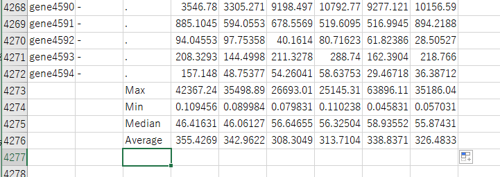
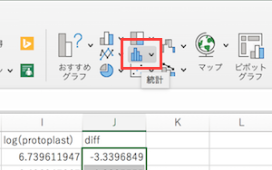
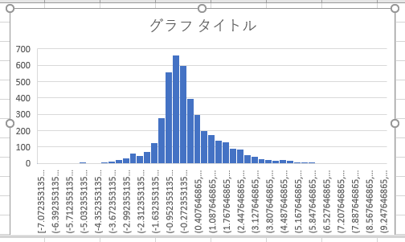
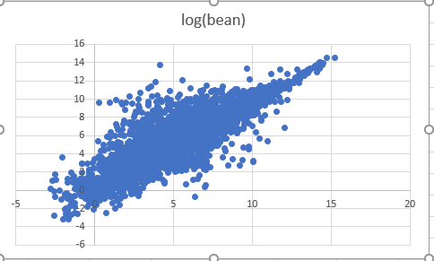

# Excel でなぞる遺伝子発現解析（納豆菌編）

普通はプログラミングかR言語でするような遺伝子発現解析を、Excelで試しに（できる部分だけ）やってみようという試み

## 今回利用するデータ
- GSE109523 ：Transcriptome analysis of Bacillus subtilis NBRC 16449 grown on surface of boiled soybeans under the similar condition to production of Japanese traditional soybean-fermented food "natto" https://www.ncbi.nlm.nih.gov/geo/query/acc.cgi?acc=GSE109523
- 日本語訳：Bacillus subtilis（枯草菌・こそうきん）NBRC 16449株における日本の伝統的な大豆発酵食品 納豆の生産と同条件下における茹でた大豆の表面での成長時のトランスクリプトーム（全遺伝子発現）解析
- 今回はこれを加工したデータを用いる ([Bsubtilis_exp.for_lec.0613.txt](https://raw.githubusercontent.com/chalkless/lecture/master/biostats/exp_natto/Bsubtilis_exp.for_lec.0613.txt))。あらかじめダウンロードしておく。（右クリックして「名前をつけて保存」）
### 生物学的背景
- 生物の遺伝情報はDNAに記録されていて（＝コードされている）、必要な時に必要な遺伝子を使うしくみになっている
- たとえば、今回の枯草菌では4.12Mb（mega base。megaは100万。baseは塩基対。ようするに412万塩基対）のDNAを持っていて、およそ4500の遺伝子を持っている（出展元：[NCBI Genome](https://www.ncbi.nlm.nih.gov/genome/?term=txid86029[Organism:noexp])）
- 「必要な時に必要な遺伝子を使うしくみになっている」とは、たとえば植物なら、葉になるときは光合成のための遺伝子発現が必要だが、根だと光合成の遺伝子発現は不要（なので不要ならmRNAが転写されない、ということ）。今回は微生物だが、たとえば、アミノ酸が周りに豊富にあれば、わざわざアミノ酸を生合成するための酵素は発現しなくてよいが、飢餓状態なら発現が必要、ということ。
- 今回は、液体培地と寒天培地とゆでた大豆の表面という3つの状態だが（ここではそのうち2つの状態について扱うが）これらの状態はどういう遺伝子変化をもたらすだろうか???

### 今回の対象となる生物について
- いわゆる納豆菌のデータ。学名は Bacillus subtilis subsp. natto。（subsp. = subspecies。亜種）。種扱いにして Bacillus nattoという名前になっていたり、変種扱いにしてBacillus subtilis var. natto という名前になっている時もある。Bacillus subtilis自体は枯草菌（枯草菌）と呼ばれている。生物学でよく使われる（よく出てくる生物ABCDEのB。← 学名の頭文字をとっている） → 参考：[NCBI Taxonomyの当該ページ](https://www.ncbi.nlm.nih.gov/Taxonomy/Browser/wwwtax.cgi?mode=Info&id=86029&lvl=3&lin=f&keep=1&srchmode=1&unlock)
- NBRCはBiological Resource Center, NITE (National Institute of Technology and Evaluation) （日本語名：（独）製品評価技術基盤機構 バイオテクノロジーセンター）のこと。経産省系の独法であるNITE（ナイト）では企業等のもっている有用微生物を寄託・譲渡してもらい、（半永久的に）保存するとともに、他の企業等に提供して産業に役立てている。
- 今回の納豆菌もNBRCのコレクションとしてストックしてある。
- NBRC 16449とは、菌株番号のこと。コレクション機関名 + 固有番号 といった形式になっている。
- NBRCとして保有している菌株は[DBRP](https://www.nite.go.jp/nbrc/dbrp/top) (Data and Biological Resource Platform) から取得できる。
- たとえば菌株番号で検索すると[Bacillus subtilis NBRC 16449の株情報](https://www.nite.go.jp/nbrc/dbrp/dataview?dataId=STNB0000000016449) が取得できる。生育温度や分離源、培地などの情報が得られる。

### [補足] GEOからの遺伝子発現データの取得
- 今回のデータは元データを加工して解析できるようにしているが、その「元データの加工」の部分をこのセクションは書いている（ので、ここGitHubにアップされているデータを使う分にはここの操作はしなくてよい）
- 今回は、すぐにExcelで開けるように加工済のデータになっているが、元々の配布されているデータは別形式（＋実験データだけでなく実験条件の情報付き）なのでそのままでは使えない。
- GEO (Gene Expression Omnibus) は、NCBIが集めている遺伝子発現のデータベース
  - もともとはマイクロアレイのデータベースだったがNGS（次世代シーケンサー）が出てきてRNA-Seqのデータもここに入ることになり、今は遺伝子発現データのデータベースとなっている。
  - てなわけで今はNGSデータの方がはやりなのだが、NGSデータの解析自体で1回の講義になってしまうレベルだし、コマンドラインや計算機リソースを駆使するような計算なので、今回はある程度そのあたりを計算済ということでマイクロアレイのデータを例とする。
- あらためまして、GEOのサイトにアクセスするのだが、今回は混乱を避けるために測定データセットを検索するサイトを示しておく。 https://www.ncbi.nlm.nih.gov/gds/
- 生物種名や生命現象を検索ボックスに入れて、どのようなデータがあるか楽しんでみましょう
  - 詳細まで見るといくつかのパターンがあることがわかります
    - 正常と疾患/変異株/薬剤処理など状態を2群間で比較するデータ
    - ある状態下でのさまざまな臓器など多サンプル間で比較するデータ
    - 薬剤処理後の時間経過ごと、発生ステージなどなどの時系列データ
- 今回は、GSE109523 ：Transcriptome analysis of Bacillus subtilis NBRC 16449 grown on surface of boiled soybeans under the similar condition to production of Japanese traditional soybean-fermented food "natto" https://www.ncbi.nlm.nih.gov/geo/query/acc.cgi?acc=GSE109523 を用いる。
- Samples の項目を見ると、どういうサンプル（試料・材料）を使って実験をしたかが書いてあります
  - 上の比較データか、時系列データか意識して、どれがセットか考えるといいでしょう
  - 場合によっては同じようなデータを何回もとっているものがあります。
    - 同じサンプルを何回か測定：technical replicates。1つの個体・細胞から複数の測定サンプルをつくることで実験操作を相殺する
    - 別個体で何回か測定：biological replicates。複数の個体・細胞から測定サンプルをつくることで個体差を相殺する
- その下のところに実際の遺伝子発現データがダウンロードできる形で置いてあるが、単純な表にはなっていないので加工が必要な場合が多い（実験情報がくっついているので、そのままではExcelで開けない。いや開けるけど、頭とか末尾を削らないといけない）
  - SOFT formatted family file(s)
  - Series Matrix File(s)
- 今回は、ラッキーな例で元データがExcelで公開されている。
- （わかる人向けの参考の中の参考情報）発現値（どのくらい遺伝子がタンパク質にするために読まれているか）がA_RPKM、B_RPKM、C_RPKMに書かれている。今回は、これをliquid, bean, agarと書き換えている。また、ここでは1回しか実験していないのだが、適当に（正規分布で乱数を発生させて）平均が元々の値になるように2つの実験のようにみせかけたデータを作成した。

## 解析の目標
- 納豆菌の培養条件の違い（今回は液体培地とゆで大豆の表面）でどんな機能の遺伝子が特異的に（=その状態のみで）働いているか?（または働いていないか?）を解析する。

## 遺伝子発現データの統計的な解析
### ファイルを開く
- いきなりつまずく人が多発する鬼門ポイントです。。。
- Excelを立ち上げる
- 今回はタブ区切り（tsv: tab separated value）なので、テキストファイル（Windowsでいうところのメモ帳で開くファイル。Excel形式でないもの）として読み込む
  - Windowsの場合：
    - シートの上にファイルをドラッグ&ドロップすると開くようです。開かない例として、ダウンロードすると「最近使ったファイルリスト」のようなところにファイルがリストされる場合があるようです。その場合はファイルを右クリックして、「保存されているフォルダを開く」のようなものを一度はさんで再度 表示し直すとドラッグできるようになります。
    - もしくは、ファイル > 開く で、ファイルの形式をExcel形式でなくタブ区切りファイル（もしくはテキストファイル）を選択するとファイルのリストに表示される（or 選択できるようになる）
  - Macの場合：ファイル > インポート から（拡張子が.txtや.tsvでない場合は、これらに変更しないといけないかもしれない）
  - Excel Online （クラウド版Excel）の場合：なぜかインポート機能がないので、あらかじめデスクトップ版ExcelやGoogle Spreadsheetで開いてExcel形式で保存し、それを開く。→ 今回はExcel版もここにアップしてある（[Bsubtilis_exp.for_lec.0614.xlsx](https://github.com/chalkless/lecture/raw/master/biostats/exp_natto/Bsubtilis_exp.for_lec.0614.xlsx)）
- 読み込みのダイアログが出た場合：区切り記号付き → 区切り文字 タブ などと選びながら次へを押していく
  - 各列のデータタイプで遺伝子名が書かれた列は標準でなく文字列を選ぶとOct4問題は回避できる
  - Oct4問題：Excelのおせっかいで、遺伝子名Oct4が、勝手に日付だと解釈されてしまう問題。実際の値が、2020/10/4などとその年の10月4日になってしまうので、早い話が遺伝子名が消されてしまう。OctXやSepXの遺伝子で起きる。
- 無事に開ける
- **[ファイルの保存]** 何はともあれファイルの保存。ファイル > **名前をつけて保存** で Excelブックとして保存
  - - 
  - 普通に（テキストファイルとして）保存してしまうと、関数やグラフが保存されないので**Excelブック（.xlsx）の形式で保存しなおす**。 
- 今回はFeature_ID、Protein_ID、Product、liquid_1、liquid_2、bean_1、bean_2、agar_1、agar_2 というデータ構成になっている。
- 全部で4,272行（うち先頭はタイトル行）。画面の分割をすると楽である。
  - 表示タブ > 分割
  - 線をドラッグすると分割場所を動かせる。端まで持って行くと分割解除
  - 下半分のウインドウのどこかのセルを選択し、スクロールバーをドラッグして末尾へ。

### データの分布を調べてみる
- データの列には遺伝子の発現量が数値で入っている
- ちらちら眺めると0に近い値から千まで数値があるような
- そこで、各列の一番下の行で最大値と最小値を計算してみましょう
  - 一番下のデータの次の行あたりでセルを選択して
  - fxから入力するなり、手入力するなり。手入力の場合、途中まで入れると候補が出るので↑/↓で選んでTABを押すと範囲指定までいける
  - 最大値を例に：`=max(`まで入力すると、範囲を聞かれるので、上ウインドウでD2（一番上）をクリックし、下ウインドウでD4272をShiftを押しながらクリック。Enterを押すと`)`が勝手に補完されて計算される。
  - 同様に最小値 `=min(...)`も
- 続けて、中央値（median）と平均値も計算してみる
- 1列分計算できたので、計算結果を複数セル選択し、右下をドラッグして数式をコピーする
- 結果が出る
  - 
- 考察：左2列がliquid（液体培地）、真ん中2列がbean（ゆで大豆の表面）、右2つがagar（寒天培地）。これからその2列どうしの数値の平均をとるが、特に中央値や平均値が大きくずれていないので、2列のデータの分布はほぼ同じそうだと期待でき、特に補正（正規化という）をせずに先に進むこととする。（すでに補正済のデータが登録されていたのかもしれない）

### 2つの状態での発現量を比較する
#### 2回の実験の平均をとる
- 左2列のliquid、真ん中2列のbeanをそれぞれ2回実験をしたとみなして、誤差を補正するために平均をとることとする。一般的には3回以上の実験（通称 n=3。nとは実験回数のこと）が望ましいとされている。
- **これは各遺伝子で2回の実験の平均をとる作業**
- agarのH列、I列はとりあえず使わないので列名を右クリックして非表示
- 今回なら、空白列であるJ1にでも liquid なり適当にラベルを振っておく
- とりあえず一番上のデータである2行目でliquid1とliquid2の2データの平均をとる（隣接するセルでないとエラーが出るが無視するを選択すればよい）
  - D2からE2の範囲指定：J2セルで`=average(` とうって、D2セルをクリック。その後、コンマを入力してE2を選択するか、shiftを押しながらE2をクリックか、でEnter
- 全データで平均値をとる。今 計算したセル（J2）を選択してコピー。ペーストしたいセルとしてまずはJ3をクリック。shiftキーを押しながら下ウインドウのJ4272をクリックしてペースト。計算結果が出ればOK
- 同様にbeanも各データの平均値を計算する
#### 各発現値の対数をとる
- 発現量データの対数をとる。この場合は今 計算した平均値に対して対数を計算する。
  - 上の方で最大値、最小値を計算した際にわかるように、ケタが4桁近く違うので、数値を扱いやすくするのだと思ってくれ
  - （とはいえ、このあと2状態の発現「比」を計算するので、その時点でだいぶケタの範囲が小さくなる気もするが）
  - あとは、対数をとると発現の分布が正規分布（イメージ：左右対称のきれいなグラフ）になるので、モデル化しやすくする、という効果も狙っている（あとで可視化して確認する）
- 平均を計算した右列に対数を計算する列を挿入する。今回はL列、M列
- 一番上に、log(liquid) などと適当にラベルをつけておく
- 対数を計算する。`=log(`とうつと`=log([数値],[底])`と関数の書式を教えてくれるので、数値として平均値のJ2をクリック、カンマを打って、底として2を入力する
  - 別に底は2でも10でもいいのだが、マイクロアレイなどの発現解析の時は、伝統的に「発現比2倍以上」というデータの絞り込みをしていたため、わかりやすくするために底は2を用いている。（というか、そういうこともわかりやすくするために対数をとるのである）
- 同様に下まで関数をコピーする。のち、beanの方も対数の計算をしておく。
- このあたりで、最初からあった生データはすでに平均をとってしまい振り返らなくてもよくなったので非表示にする。D列～G列をshiftキーを押しながらクリックし、列の上で右クリックして非表示を選ぶ。
  - 参考までに、元に戻す時は、隣接する2列（この場合はC列とJ列）を選んで右クリックすると再表示メニューが出てくる。
- 発現比を計算する。
- **今回やりたいのは、元のデータが何倍の発現量差があるかなので、対数の比をとるのでなく、比をとった後で対数をとる**
  - 覚えていますか：log(A/B) = log(A) - log(B)
  - とりあえずラベルをつける。N1にdiffとか書いておく
  - N2で`=` → M2（log(bean)) をクリック → `-` → L2（log(liquid)）をクリック → Enter
  - `=M2-L2`（`log(bean)-log(liquid)`）という計算ができあがっているはず
- 計算を全行分コピーして実行

### 発現量比較のデータを眺めてみる
- diff 列のデータの意味を振り返ってみる
  - `diff = 2` ：log(diff)=2 だから2^2で4倍の発現差がある。この場合、beanの発現が高い
  - `diff = -2`：log(diff)=-2 だから1/(2^2)で1/4倍の発現差がある。この場合、beanの発現が1/4だから、liquidの方が4倍発現が高い
  - `diff = 0`：log(diff)=0 ということ。つまり、2^0=1。ようするに、beanとliquidで発現量が同じということ
- 試しに diff 列について、`max`, `min`, `average`, `median` を計算してみる
  - 特にaverage、medianはほぼ0のはず。（というか、元の分布がそうなるようにすでに補正してあるわけである）。ちょとずれてるけどｗ
- 実際のデータの分布がどんなかヒストグラムを描いて確認してみる
- diff 列のデータ部分を選択して、挿入タブ > （グラフの中の）統計 を選ぶ
  - 
- ヒストグラムを選択すると、グラフが描画される
  - 
  - 0 を中心に左右対称になっている
  - （もう少し横幅を狭めたいのだが、Excelでできるのかどうか調べてできたら追記することとする）
- 実際のデータで分布がどうなっているかも散布図 (scatter plot) で確認することとする
- とりあえず（グラフを描くのに操作が煩雑になるので）平均の列を非表示にする（この場合、D列とH列）
- diffを取る前の、2つのlog列を選択して、挿入タブ > 散布図 > 散布図
  - 
- 散布図 (scatter plot) が描画される
  - 
- 散布図 (scatter plot) を眺めてみる
  - y=x 、つまり、log(bean)=log(liquid)の線が心の目で見えるが、これはようするに発現が変動していない遺伝子はこの上に載りますということ。
  - その線から離れるほど、発現が変わっている
  - 下に離れるとliquidで発現が大きい、上に離れるとbeanで大きい

## 発現に差のある遺伝子の機能解析
- **覚えていますか**：[解析の目標] 納豆菌の培養条件の違い（今回は液体培地とゆで大豆の表面）でどんな機能の遺伝子が特異的に（=その状態のみで）働いているか?（または働いていないか?）を解析する。

### 発現に差のあるデータの絞り込み
- beanで発現の高い遺伝子のみを抽出してみる。今回は試しに8倍以上にしてみる
  - 8 という数字は適当です。
  - 適当というのは、まぁ、こんなもんかな、ってことです。
  - どうしてまぁ、こんなもんかなって思うかは、試しに絞り込んでみて、（全体が数千くらいに対して）いくつくらいに絞り込めるかとか、結果を見てみたらきれいになったとか、信頼度がどのくらいかとか、そういうので決めているだけで、統計的にかっちり基準があるわけではありません。
  - またあとでこのあたりは出てきます
- とりあえず、フィルターするとデータの個数が何個になるか気になるのでその用意をすることとする。
- 関数名がわからないので「Excel フィルター 個数」などとググる
- と、どうやら`=subtotal(3,範囲名)`と書けばいいらしい
  - 3 は`counta`関数と同じく、空白でないセルの個数を返すという呪文らしい
- diffで絞り込むのでdiffの列にでも移動して`=subtotal(3,N2:N4272)`と書いておく（範囲指定は手打ちしなくてもこれまでやっている選択→shift+選択でまったくかまわない）
  - 4271と出れば成功
- ここからやっと絞り込み
- diffラベルのセルを選択して（別にどこでもいいのだが）ホームタブ > 並べ替えとフィルター > フィルター。すると、ラベル行の各セルに▼がつく
- diffラベルのセルで▼をクリックすると、どうフィルターするか出てくるので、「1つ選択してください」から「指定の値以上」で 3 (log(8)=3だから)と指定する
- としばらくExcelが考え、下半分のウインドウが真っ白なシートを表示するので、おちついてスクロールバーをドラッグして表示していあるところまで上にスクロール
- 何個 表示されているか確認
  - 209個かー。ちょっと多いなー。もう少し絞り込むかー
  - というわけで、対数で4（実データで16倍）くらいにしてみる
  - diffラベルの▼は電波の弱いガラケーアンテナのような形になっているが、再びそれをクリックし、3以上を4以上にする
  - 112個になった。
  - 今回はこのくらいで許してやろう
  - 結果的に対数で4（実データで16倍）になったが、「このくらいで」というのは人間が見れるくらいの数くらいのイメージ。別に3でも5でも10でもよい。また別基準で上位50件、上位100件としてもよい（ただだいたい何倍くらいになっているかは確認した方がいい気はする）。

### 遺伝子機能解析
- ここから遺伝子機能解析を専門のサイトでやります。（本当はExcelでやりたいのだが）
- DAVIDでググる。と、DAVID Functional Annotation Bioinformatics Microarray Analysis というサイトが出てくる（はず）。クリックしてそのサイトに行く
  - ちなみに https://david.ncifcrf.gov/
  - DAVIDは（遺伝子機能による）エンリッチメント解析ということをやるサイトです。ランダムに選んだ遺伝子セットに対して、この遺伝子セットは顕著にこの機能が多いですね、みたいなものを可視化してくれます。
- タイトル下の Start Analysis をクリック
- 画面が切り替わり、左カラムに入力ボックスが現れる
- Excelに戻って、IDをコピーする
  - B列のProtein_IDを使う
  - データのない"-"はノイズになってしまうので、▼をクリックして -　の横のチェックを外す
  - ここで、１列だけ（多分、この場合はdiffの列でしょう）▼やケータイのアンテナマークがある場合は、１列だけ選択してフィルターをかけてしまっています。一度、フィルターを外して、適当なデータのところをクリックし、再度フィルターをかけると全部の列にフィルターがつくはずです。
  - B列で（見た目で）2行目から一番下まで（max とか # of dataはいらない）をコピーする
  - DAVIDのPaste a listにペースト
-　Step 2で”UNIPROT_ACCESSION”を選ぶ
- ペーストした下の方の Step 3 でGene Listを選ぶ
- Step 4でSubmit Listをポチる
- 真ん中上にAnalysis Wizard、左カラムでBacillus subtilisなどと出れば成功
  - 返ってこないときは、ご相談ください（とりあえずbean/liquidでbeanで増えるものは動くのは確認した）
- Functional Annotation Toolをクリック
- 機能解析メニューが出てくる
- よく使うのは Gene Ontology
  - Ontologyというのは階層型の用語集
    - 階層型というのは 人体 > 泌尿器系 > 腎臓 > 糸球体 のようなこと
- 解析：GOTERM_BP_ALL の右のChartをクリック
  - BPは biological process。生物学的な挙動（そのままw）
  - teichoic acidやcell wall （細胞壁）の単語がチラホラ
  - もともとの2群の違いは細胞壁があるかないか
  - いいじゃないか
-　本当はGO_CC（Cellular Component：細胞のパーツ）やGO_MF（Molecular Function）でもいろいろ出てほしいのだが...

## まとめと発展
- Excelで統計の手法で遺伝子を絞り込み、機能解析をしてみた
- よくR言語での〜というのがあるが、Excelでもこのくらいならできる
  - 昔は256列までしか扱えなかったので、しんどかった時代もある
- 今回は、beanで発現の高い遺伝子について解析したが、もちろんliquidで発現の高い遺伝子についても同様の解析をやってみたりする。
- さらに、今回は発現の高い遺伝子「セット」で解析をしたが、そこに含まれる実際の遺伝子は何か、というのをマイクロアレイのプローブIDから遺伝子名に直して眺めたりするわけである。
  - GEOのサイトにあるSOFT formatted family file(s)には対応表が載っているので、あらかじめそれをExcelででも列追加して解析を始めるか、あとで個別に眺めるかするわけである
- さらに今回は、液体培地と茹でた大豆の表面いう2群だったが、他の例だと「通常と薬剤処理の細胞」、「通常期と繁殖期の魚」、「淡水型と海水型の魚」、「春型と夏型のチョウ」、「タバコを吸う人と吸わない人」などなどの前提条件と、条件の違いで遺伝子発現がどう変化するかというような研究が考えられるわけだ。
- **生物統計というと、ついついどんな統計手法で、と統計の方に目がいってしまうが、生物学のゴールは統計処理でなくて、そこで得られた遺伝子セットを生物学的に解釈する（そして最初の実験条件と照らし合わせる）、というところなのをお忘れなく。**
