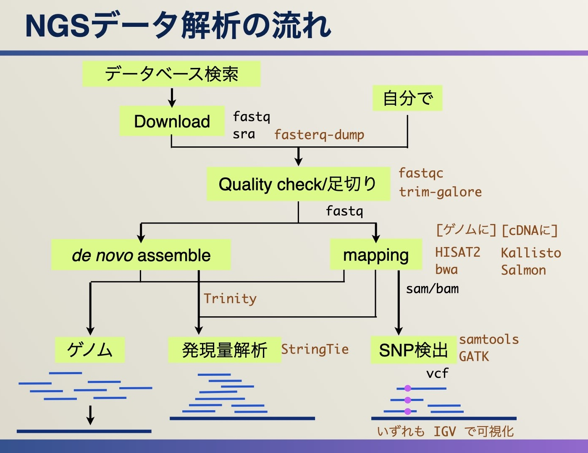
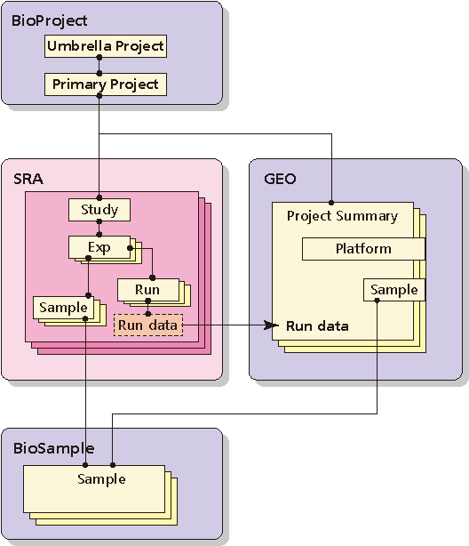
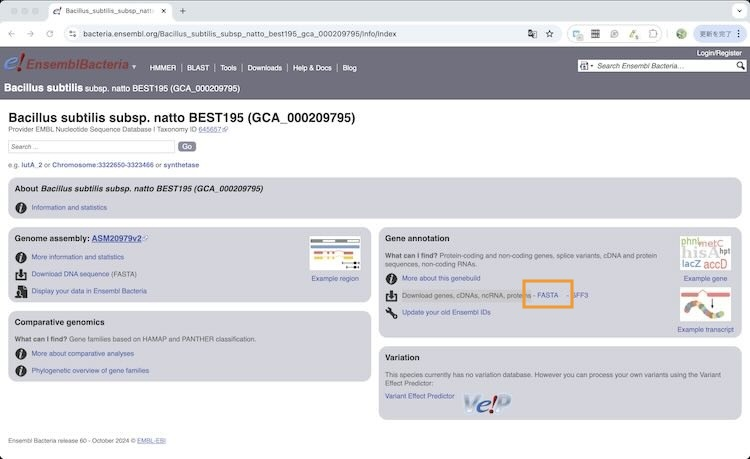

# 遺伝子発現解析（納豆菌編）のためのNGS解析

## このページは...
- もともと、公共データベース（今回はGEO）で公開されている遺伝子発現データを用いて、遺伝子発現解析（データ比較 → 発現に差のある遺伝子のピックアップ → その機能解析）をする方法を公開している
  - [Python（on Google Colab）で遺伝子発現解析（納豆菌編）](./expNattoByPythonOnColab.ipynb)：Google Colabバージョン。（ipynbファイル）
  - [Excel でなぞる遺伝子発現解析（納豆菌編）](./expNattoByExcel.md)：Excel版
- ↑ このデータはGEOの元データで配布されている、すでに発現データにされたものを加工して用いている
- このページは別に登録されたNGSデータ（readデータ）から発現データまでをNGS解析としてなぞったときにどうなるかを解説している
- （おことわり）そのため、このページで得られた結果の発現量データと、GEOで配布された発現量データが同じである保証はない。

## そもそもNGSとは
- [NGS解析解説](../../ngs/README.md)

## 解析の概要


## データの検索
- NCBI、EBIもあるがDDBJ Searchを使う：https://ddbj.nig.ac.jp/search/
- 検索の前にデータ構造について
  - 
  - もともとSRA (Sequence Read Archive)だけだったが、そこから派生した遺伝子配列（GenBank Nucleotide）や発現データ（GEO）と一体的に管理するためにBioProjectとBioSampleができた
  - 参考：[各メタデータの解説](https://github.com/chalkless/lecture/blob/master/ngs/README.md#%E3%83%87%E3%83%BC%E3%82%BF%E6%A7%8B%E9%80%A0)
- DDBJ Searchをいくつかの切り口で検索してみる
  - キーワード
  - 生物種
  - → 左側でBioProject、SRAなどのデータタイプや生物種で絞り込みする（本当はゲノム、RNA-Seq、メタゲノム、SNP解析など目的別でも絞り込みしたい）

## 今回 用いるデータ
- Transcriptome analysis of Bacillus subtilis NBRC 16449 grown on surface of boiled soybeans under the similar condition to production of Japanese traditional soybean-fermented food "natto"
  - https://ddbj.nig.ac.jp/search/entry/bioproject/PRJNA431298
- データの見方：データ構造にしたがって確認する
  - この場合、3実験している：3つのexperiment/sampleペア
  - 何が違うのか（〜を見る、とあるが、実際はすべて確認してどこが違うかを確認する。概要はBioProjectやsra-studyでのタイトルや実験のdescription（説明）から読み解ける）
    - サンプルそのものが違う場合：野生株とノックアウト株、 → サンプル情報（BioSample）を見る
    - 同じサンプルに異なる処理をした場合：無処理と薬剤処理 → 実験情報（sra-experiment）を見る
    - この場合は、experimentを見ると、同じ納豆菌を液体培地、寒天培地、茹で大豆の表面の3つの条件で培養しているのがわかる。BioSampleのところからも読み取れる。

## 実験データのダウンロード
- experiment/sampleに紐づいたrunのページからダウンロードできる
- 配布形式
  - fastqファイル：シーケンスとそのクオリティ（品質）について記載されたファイル（DDBJからは取得できる場合もある）：[詳細](https://github.com/chalkless/lecture/blob/master/ngs/README.md#ngs%E3%83%87%E3%83%BC%E3%82%BF%E3%81%AE%E9%85%8D%E5%B8%83%E5%BD%A2%E5%BC%8F)
  - sraファイル：fastqファイルと実験情報をまとめて圧縮したファイル（NCBIはこの形式のみ配布）
- 実際のダウンロード
  - fasterq-dump（sra-toolkitに同梱）でIDを指定すればsraファイルのダウンロードとfastqファイルへの展開をやってくれる
    ```
    # 参考
    $ fasterq-dump SRR6504026
    ```
  - ただダウンロードからやると時間がかかるので（多分、NCBIからダウンロードすると想像されるため）、自分でDDBJからダウンロードして fasterq-dump でファイルを指定する方が早い
    ```
    $ wget https://ddbj.nig.ac.jp/public/ddbj_database/dra/sralite/ByExp/litesra/SRX/SRX359/SRX3592650/SRR6504026/SRR6504026.sra
    $ fasterq-dump SRR6504026.sra
    ```
  - [fasterq-dumpについて](https://github.com/chalkless/lecture/blob/master/ngs/README.md#%E3%83%87%E3%83%BC%E3%82%BF%E3%81%AE%E3%83%80%E3%82%A6%E3%83%B3%E3%83%AD%E3%83%BC%E3%83%89%E3%81%A8%E5%B1%95%E9%96%8B)
  - この場合は3条件あるので3つのsraファイルをダウンロードして展開する
  ```
  $ ls -alF
  合計 37319880
  drwxrwxr-x 2 chalkless chalkless       4096 10月 23 01:09 ./
  drwxrwxr-x 8 chalkless chalkless       4096 10月 23 01:27 ../
  -rw-rw-r-- 1 chalkless chalkless 6296829720 10月 23 00:46 SRR6504026_1.fastq
  -rw-rw-r-- 1 chalkless chalkless 6296829720 10月 23 00:46 SRR6504026_2.fastq
  -rw-rw-r-- 1 chalkless chalkless 6882323840 10月 23 00:46 SRR6504027_1.fastq
  -rw-rw-r-- 1 chalkless chalkless 6882323840 10月 23 00:46 SRR6504027_2.fastq
  -rw-rw-r-- 1 chalkless chalkless 5928604588 10月 23 00:46 SRR6504029_1.fastq
  -rw-rw-r-- 1 chalkless chalkless 5928604588 10月 23 00:46 SRR6504029_2.fastq
  ```
  - _1と_2があるのはペアエンドだから

## クオリティチェックとトリミング
- Quality Checkは```fastqc```、トリミング（クオリティが低い部分を足切りする）は（さまざまなツールがあるが）```trim-galore```というツールがある。
- trim-galoreをかけると中でfastqcもやってくれるのでいきなりトリミングの操作に進む
- [trim-galoreについて](https://github.com/chalkless/lecture/tree/master/ngs#%E3%83%88%E3%83%AA%E3%83%9F%E3%83%B3%E3%82%B0)
```
$ trim-galore --paired --illumina --fastqc -o trimmed_SRR6504026 SRR6504026_1.fastq SRR6504026_2.fastq
```
```
  - trim-galore：コマンド名
  - --paired：ペアエンド
  - --illumina：Illuminaで得られたリード（アダプター配列なる業者独自のシーケンスがリードについているのでこれを除去するため）
  - --fastqc：fastqcもかける
  - -o：出力先
  - SRR6504026_1.fastq/SRR6504026_2.fastq：リードを指定
```
```
$ ls -alF trimmed_SRR6504026/
合計 9722120
drwxrwxr-x 2 chalkless chalkless       4096 10月 23 00:55 ./
drwxrwxr-x 5 chalkless chalkless       4096 10月 23 01:10 ../
-rw-rw-r-- 1 chalkless chalkless       3587 10月 23 00:51 SRR6504026_1.fastq_trimming_report.txt
-rw-rw-r-- 1 chalkless chalkless 4979743958 10月 23 00:53 SRR6504026_1_val_1.fq     ← トリミングされたリード・その1
-rw-rw-r-- 1 chalkless chalkless     659895 10月 23 00:54 SRR6504026_1_val_1_fastqc.html
-rw-rw-r-- 1 chalkless chalkless     407090 10月 23 00:54 SRR6504026_1_val_1_fastqc.zip
-rw-rw-r-- 1 chalkless chalkless       3784 10月 23 00:53 SRR6504026_2.fastq_trimming_report.txt
-rw-rw-r-- 1 chalkless chalkless 4973520680 10月 23 00:53 SRR6504026_2_val_2.fq     ← トリミングされたリード・その2
-rw-rw-r-- 1 chalkless chalkless     666371 10月 23 00:55 SRR6504026_2_val_2_fastqc.html
-rw-rw-r-- 1 chalkless chalkless     415992 10月 23 00:55 SRR6504026_2_val_2_fastqc.zip
```
- どのくらい足切りされたか
```
$ ls -alFh 02_fastq/SRR6504026_?.fastq 
-rw-rw-r-- 1 chalkless chalkless 5.9G 10月 23 00:46 02_fastq/SRR6504026_1.fastq
-rw-rw-r-- 1 chalkless chalkless 5.9G 10月 23 00:46 02_fastq/SRR6504026_2.fastq
$ ls -alFh 03_trimmed/SRR6504026_?_val_?.fq 
-rw-rw-r-- 1 chalkless chalkless 4.7G 10月 23 01:10 03_trimmed/SRR6504026_1_val_1.fq
-rw-rw-r-- 1 chalkless chalkless 4.7G 10月 23 01:10 03_trimmed/SRR6504026_2_val_2.fq
```

## マッピング先cDNAデータのダウンロード
- リードデータから発現量にするのに3つの方法がある
  - cDNA（transcript）データにマッピングする ← 今回はこれ
  - ゲノムデータにマッピングする：別途、どの領域が遺伝子かのデータも対応づける
  - de novo assemble：ゲノム配列などがよくわかっていない生物などはリードデータからtranscript候補を組み上げて、その量で発現量とする
- [データをどこからダウンロードするか（解説編）](https://github.com/chalkless/lecture/edit/master/ngs/read2transcript.md#reference-%E3%81%AE%E9%85%8D%E5%88%97%E3%82%92%E5%8F%96%E3%81%A3%E3%81%A6%E3%81%8F%E3%82%8B)
- データをどこからダウンロードするか（実践編）
  - 今回はEnsemblから取ってくる
  - https://www.ensembl.org/index.html ← たまにサイトが落ちるのでUSかUKのミラーサイトを使う。”Ensembl mirror”でググる
  - 一番下に行くとEnsembl Bacteriaがあるのでクリック
  - "Search for a genome" 欄に学名を打ち込む → "Bacillus subtilis subsp. natto BEST195 (GCA_000209795)"が候補に出てくる
  - 右カラム "Gene annotation" 欄 "Download genes, cDNAs, ncRNA, proteins" でFASTAをクリック
  - 
  - cdsやcdnaと複数の選択肢が出るがcdsでいいと思う。（詳しい違いは各々のディレクトリのREADMEに載っている）
  - 今回は "Bacillus_subtilis_subsp_natto_best195_gca_000209795.ASM20979v2.cds.all.fa.gz	" をダウンロード（当該ファイルの上で右クリックしてリンクをコピー）
  ```
  $ wget https://ftp.ensemblgenomes.ebi.ac.uk/pub/bacteria/release-60/fasta/bacteria_118_collection/bacillus_subtilis_subsp_natto_best195_gca_000209795/cds/Bacillus_subtilis_subsp_natto_best195_gca_000209795.ASM20979v2.cds.all.fa.gz
  ```

### cDNAデータのindexを作成する
- mappingにはsalmonを用いる。他にkallistoもあるが機能は同等：[salmonについて](../..//ngs/read2transcript.md#transcript%E3%81%AB%E3%83%9E%E3%83%83%E3%83%94%E3%83%B3%E3%82%B0salmon)
- 愚直にマッピングするとものすごく時間とマシンパワーを有するのであらかじめindex（目次、索引）を作っておいて高速化する
```
$ salmon index -t Bacillus_subtilis_subsp_natto_best195_gca_000209795.ASM20979v2.cds.all.fa.gz -i idx_natto
```
```
  - salmon：コマンド
  - index：サブコマンド
  - -t：cDNAのファイル。gz圧縮をほどかなくてもそのまま指定できる。頭の数文字を打ってTABボタンを押せば候補が出てくる
  - -i：インデックス名
```
- idx_nattoフォルダができる（数秒程度で）

### マッピングと定量
```
$ salmon quant -i idx_natto -l A -1 SRR6504026_1_val_1.fq -2 SRR6504026_2_val_2.fq -p 8 -o rslt_liquid/ --validateMappings
```
```
  - salmon：コマンド
  - quant：サブコマンド
  - -i：インデックスフォルダ名
  - −1/-2：リードファイル
  - -o：結果出力先
  - -l A：おまじない（＝とりあえずつけておく）。実体はファイルの中身を自動判別して処理する
  - -p 8：プロセス数。並列計算数。CPUの性能に依存
  -　--validateMappings：おまじない。実体は確認しながらマッピング処理を行う（というようなことだと思う）
```
- この場合、rslt_liquid ディレクトリに quant.sf ができる
```
$ head quant.sf 
Name    Length  EffectiveLength TPM     NumReads
ENSB:_1XWrIT46nDdyh5    717     525.871 71.657219       1341.109
ENSB:GfT3g8CHnN8MWkg    1353    1161.805        127.648109      5278.036
ENSB:zqGUN6Rb66DCmFS    558     367.433 20.189275       264.012
ENSB:47g597rrPiMeJYR    600     409.161 211.411210      3078.555
ENSB:48iL_8XOhA8j-pI    1329    1137.805        1.926203        78.000
ENSB:TPyWKGy9qGJ-nWA    342     158.964 9.250693        52.336
ENSB:40DIObYMiE_-44L    984     792.805 405.289652      11435.541
ENSB:8pLse09_WnAhiSG    363     178.297 98.978792       628.075
ENSB:n6UL2gFSmVuWHhS    576     385.307 14.293029       196.000
```
- 参考までにマッピング率も確認できる
```
$ less logs/salmon_quant.log 
...
[2024-10-23 01:32:18.239] [jointLog] [info] Mapping rate = 75.32%
...
```

### 発現データの中身
- TPMが発現量にあたる：TPM ＝ Transcripts Per Kilobase Million
- マップされたリード数が多いと発現量が多い ＋ 遺伝子長が長いとマップされたリード数が増える → リード数を遺伝子の長さで正規化して単位長さあたりのリード数にする

- どの遺伝子かはCDSファイルの中身と付き合わせる
```
$ gunzip -c Bacillus_subtilis_subsp_natto_best195_gca_000209795.ASM20979v2.cds.all.fa.gz | head -1
>ENSB:_1XWrIT46nDdyh5 cds primary_assembly:ASM20979v2:Chromosome:3322700:3323416:-1 gene:ENSB:_1XWrIT46nDdyh5 gene_biotype:protein_coding transcript_biotype:protein_coding gene_symbol:lutA_2 description:Lactate utilization protein A
```
```
# EnsemblのCDSファイルをダウンロードした場所にあるREADMEより
>TRANSCRIPT_ID SEQTYPE LOCATION GENE_ID GENE_BIOTYPE TRANSCRIPT_BIOTYPE

Example of an Ensembl CDS header:

>ENST00000525148.1 cds chromosome:GRCh37:11:66188562:66193526:1 gene:ENSG00000174576.1 gene_biotype:protein_coding transcript_biotype:nonsense_mediated_decay
 ^                 ^   ^                                        ^                      ^                           ^
 TRANSCRIPT_ID     |   LOCATION                                 GENE_ID                GENE_BIOTYPE                TRANSCRIPT_BIOTYPE
                SEQTYPE
```
- 本来はCDSファイルのFASTAファイルでヘッダ行を加工してTranscript ID、遺伝子シンボル、遺伝子名と対応づけられるといいかもしれない
