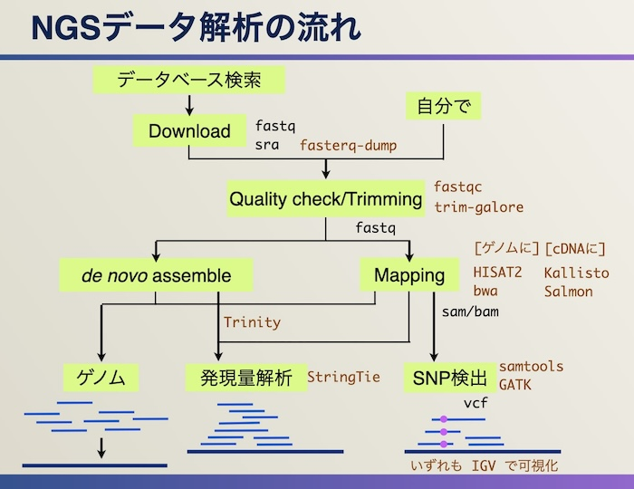

# 遺伝子発現解析（納豆菌編）のためのNGS解析

## このページは...
- もともと、公共データベース（今回はGEO）で公開されている遺伝子発現データを用いて、遺伝子発現解析（データ比較 → 発現に差のある遺伝子のピックアップ → その機能解析）をする方法を公開している
  - [Python（on Google Colab）で遺伝子発現解析（納豆菌編）](./expNattoByPythonOnColab.ipynb)：Google Colabバージョン。（ipynbファイル）
  - [Excel でなぞる遺伝子発現解析（納豆菌編）](./expNattoByExcel.md)：Excel版
- ↑ このデータはGEOの元データで配布されている、すでに発現データにされたものを加工して用いている
- このページは別に登録されたNGSデータ（readデータ）から発現データまでをNGS解析としてなぞったときにどうなるかを解説している
- （おことわり）そのため、このページで得られた結果の発現量データと、GEOで配布された発現量データが同じである保証はない。

## そもそもNGSとは
- [NGS解析解説](../../ngs/README.md)

## 解析の概要


## データの検索
- NCBI、EBIもあるがDDBJ Searchを使う：https://ddbj.nig.ac.jp/search/
- 検索の前にデータ構造について
  - 
  - もともとSRA (Sequence Read Archive)だけだったが、そこから派生した遺伝子配列（GenBank Nucleotide）や発現データ（GEO）と一体的に管理するためにBioProjectとBioSampleができた
  - 参考：[各メタデータの解説](https://github.com/chalkless/lecture/blob/master/ngs/README.md#%E3%83%87%E3%83%BC%E3%82%BF%E6%A7%8B%E9%80%A0)
- DDBJ Searchをいくつかの切り口で検索してみる
  - キーワード
  - 生物種
  - → 左側でBioProject、SRAなどのデータタイプや生物種で絞り込みする（本当はゲノム、RNA-Seq、メタゲノム、SNP解析など目的別でも絞り込みしたい）

## 今回 用いるデータ
- Transcriptome analysis of Bacillus subtilis NBRC 16449 grown on surface of boiled soybeans under the similar condition to production of Japanese traditional soybean-fermented food "natto"
  - https://ddbj.nig.ac.jp/search/entry/bioproject/PRJNA431298
- データの見方：データ構造にしたがって確認する
  - この場合、3実験している：3つのexperiment/sampleペア
  - 何が違うのか（〜を見る、とあるが、実際はすべて確認してどこが違うかを確認する。概要はBioProjectやsra-studyでのタイトルや実験のdescription（説明）から読み解ける）
    - サンプルそのものが違う場合：野生株とノックアウト株、 → サンプル情報（BioSample）を見る
    - 同じサンプルに異なる処理をした場合：無処理と薬剤処理 → 実験情報（sra-experiment）を見る
    - この場合は、experimentを見ると、同じ納豆菌を液体培地、寒天培地、茹で大豆の表面の3つの条件で培養しているのがわかる。BioSampleのところからも読み取れる。

## 実験データのダウンロード
- experiment/sampleに紐づいたrunのページからダウンロードできる
- 配布形式
  - fastqファイル：シーケンスとそのクオリティ（品質）について記載されたファイル（DDBJからは取得できる場合もある）：[詳細](https://github.com/chalkless/lecture/blob/master/ngs/README.md#%E3%83%87%E3%83%BC%E3%82%BF%E6%A7%8B%E9%80%A0)
  - sraファイル：fastqファイルと実験情報をまとめて圧縮したファイル（NCBIはこの形式のみ配布）
- 実際のダウンロード
  - fasterq-dump（sra-toolkitに同梱）でIDを指定すればsraファイルのダウンロードとfastqファイルへの展開をやってくれる
    ```
    # 参考
    $ fasterq-dump SRR6504026
    ```
  - ただダウンロードからやると時間がかかるので（多分、NCBIからダウンロードすると想像されるため）、自分でDDBJからダウンロードして fasterq-dump でファイルを指定する方が早い
    ```
    $ wget https://ddbj.nig.ac.jp/public/ddbj_database/dra/sralite/ByExp/litesra/SRX/SRX359/SRX3592650/SRR6504026/SRR6504026.sra
    $ fasterq-dump SRR6504026.sra
    ```
  - [fasterq-dumpについて](https://github.com/chalkless/lecture/blob/master/ngs/README.md#%E3%83%87%E3%83%BC%E3%82%BF%E3%81%AE%E3%83%80%E3%82%A6%E3%83%B3%E3%83%AD%E3%83%BC%E3%83%89%E3%81%A8%E5%B1%95%E9%96%8B)
  - この場合は3条件あるので3つのsraファイルをダウンロードして展開する
  ```
  $ ls -alF
  合計 37319880
  drwxrwxr-x 2 chalkless chalkless       4096 10月 23 01:09 ./
  drwxrwxr-x 8 chalkless chalkless       4096 10月 23 01:27 ../
  -rw-rw-r-- 1 chalkless chalkless 6296829720 10月 23 00:46 SRR6504026_1.fastq
  -rw-rw-r-- 1 chalkless chalkless 6296829720 10月 23 00:46 SRR6504026_2.fastq
  -rw-rw-r-- 1 chalkless chalkless 6882323840 10月 23 00:46 SRR6504027_1.fastq
  -rw-rw-r-- 1 chalkless chalkless 6882323840 10月 23 00:46 SRR6504027_2.fastq
  -rw-rw-r-- 1 chalkless chalkless 5928604588 10月 23 00:46 SRR6504029_1.fastq
  -rw-rw-r-- 1 chalkless chalkless 5928604588 10月 23 00:46 SRR6504029_2.fastq
  ```
  - _1と_2があるのはペアエンドだから

## マッピング先cDNAデータのダウンロード
- リードデータから発現量にするのに3つの方法がある
  - cDNA（transcript）データにマッピングする ← 今回はこれ
  - ゲノムデータにマッピングする：別途、どの領域が遺伝子かのデータも対応づける
  - de novo assemble：ゲノム配列などがよくわかっていない生物などはリードデータからtranscript候補を組み上げて、その量で発現量とする
- データをどこからダウンロードするか（解説編）
  - Ensembl（http://ensembl.org/） ← 今回はこれ
    - データがきれいにまとまっている
    - 表向きはヒト、マウス、ラット、ゼブラフィッシュなどのメジャーどころ（＋脊椎動物?）。ページ最下部にEnsembl PlantやEnsembl Fungi、Ensemble Bacteriaなどの分類群ごとにまとまった別ページへのリンクがある
    - 意外とAsia（シンガポール）のブランチサーバーが落ちているので、アメリカかイギリスのミラーサイトにアクセスする：https://www.ensembl.org/info/about/mirrors.html （もしくは"Ensembl mirror"でググる）
  - NCBI Datasets（旧：NCBI Genome）から
    - 生物種名を入力。スペルをミスったりするので、NCBI Taxonomyで検索してGenomeに飛んでもいい。が、いろいろ出てくるので、どれを選んでいいのかわからないところはある。CompletenessやContig数で判断したりする。
  - 専門のデータベース
    - コミュニティで独自に作られたデータベースでデータを公開している場合がある（例：[WormBase](https://wormbase.org/)、[FlyBase](https://flybase.org/)）
- データをどこからダウンロードするか（実践編）

