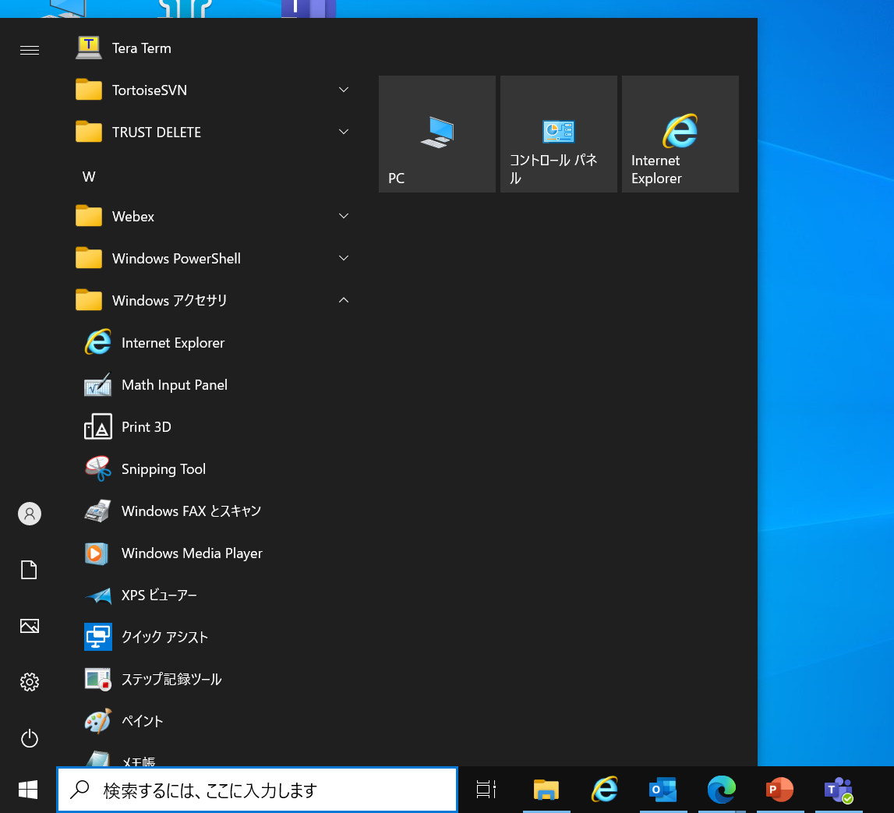
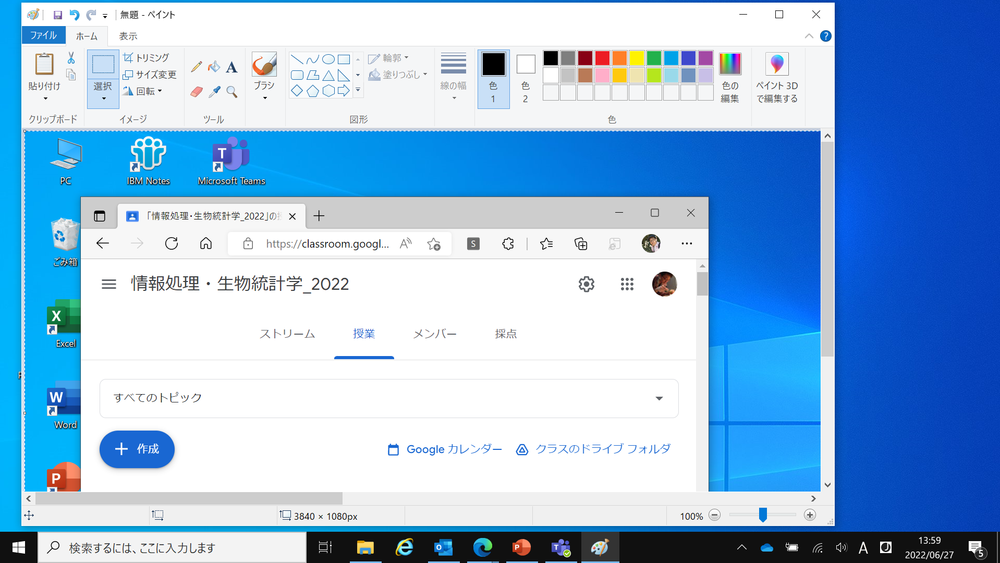

# パソコンの画面をキャプチャーする
- 「パソコン 画面 キャプチャー」とかでググるとたくさん出てくるが、その一端だけを紹介

## Windows編
- キャプチャーしたい画面を用意する
- キーボードの右側Enterキーの上～斜め上くらいにPrint Screen（もしくは略してPrtScrなど）というキーがあるので押す
  - ノートパソコンの場合、青い字だったり四角で囲われている場合が多々あるが、多分、キーボード左下のFnキー（ファンクションキー）が同じく青字だったり四角で囲われているので、それと一緒に押す。
- Windowsメニュー ＞ Windows アクセサリ ＞ ペイント
- 
- （ペイントアプリが立ち上がる）
- Ctrl+V（貼り付け）
- 
- デスクトップ全体をキャプチャーした画像が現れるので、メニューの左の方のトリミングをクリックしたり範囲をドラッグしたりして必要部分を加工する
- ファイルに保存

## Mac編
- キャプチャーしたい画面を用意する
- プレビューのソフトを立ち上げる
- ファイル ＞ スクリーンショットを撮る ＞ 画面全体 or ウインドウ
- プレビューでキャプチャーされた画像が出てくるので、適宜トリミングする
