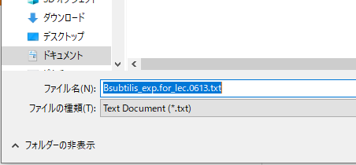
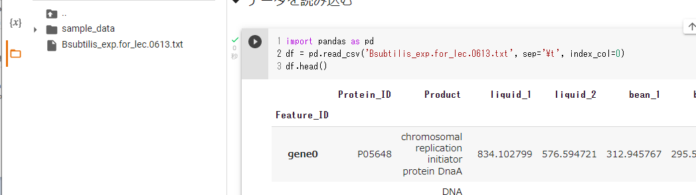
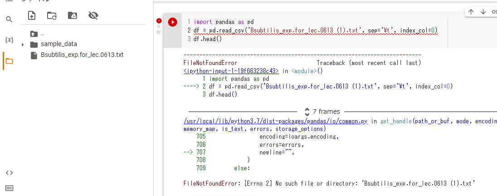

# Google Colaboratoryでのファイルのアップロード
Goole Golaboratory （通称：Google Colab）での（主にデータの）ファイルのアップロードはなかなかの鬼門でハマったりするので、ここで改めてまとめてみた。

## 以前に使ったGoogle Colabのファイル自体を開く
- 「colab」などでググったりすると、Google Colabのページが開くので前に使ったファイルを選択して開く。（もしくは ファイル ＞ ノートブックを開く）

- 仮に複数のGoogleアカウントを持っていたりすると、別のアカウントでGoogle Colabを開こうとしている可能性もある。その場合、別アカウントのGoogle Colabのファイルは参照できない。
  - この場合は、一度、キャンセルなどしてファイルの選択画面を終了させた後、右上の自分のアイコンをクリックして適切なアカウントに切り替える。（上の画像だと、グレーアウトしているところの右上のアイコン）
- 画面左端のフォルダアイコンをクリックすると、アップロードされたファイルリストが見られる画面になる。
  - 
- たとえ前回に（データなどの）ファイルをアップロードしたとしても通常はここで sample_data しかリストされない。
  - 
  - Google Colabで、ディスクリソースを有効活用するため、自分がアップしたファイルはしばらくアクセスがなかったり時間のたったものはGoogle Colab上のスペースからファイルが消えてしまう。
  - ということで、ファイルの再アップロードから毎回スタートさせる。
- データを保存したフォルダを開く
  - とか言いながら、かなり多くの人がファイルを行方不明にさせているのである。。。
  - 普通は「ドキュメント」（か「書類」）か「ダウンロード」、「デスクトップ」のあたりな気がします。
  - わからなくなったら、元データのページに行って、もう一度ダウンロードしてみる。と、えてしてそこにある。
  - 
  - ↑ この場合だと「ドキュメント」にBsubtilis.exp_for_lec.0613.txtという名前で保存しようとしている。
  - 参考までに、すでに同じファイルがある場合は名前が「Bsubtilis.exp_for_lec.0613 (1).txt」などと自動的に(数字)が追加されて、前のものをうっかり上書きしないようになっている。
- 目的のファイルをファイルリストの画面からブラウザのGoogle Colabのファイルリストの部分（上で言うとsample_dataと書いてあるあたりの白い部分）にドラッグするとファイルがアップされます。
  - sample_dataの下にアップしたファイルの名前が出たら成功
- トラブル例
  - ファイル名のリストにわけのわからないいろいろなファイルのリストが出てしまった
    - 
    - → ブラウザの更新ボタン（アドレスが書いてある右か左の丸く矢印が書いてあるボタン。もしくはCtrl+R）を押しましょう。参考までにcontentディレクトリの中に保存してもよいです。
  - ドラッグしてもアップされない
    - いくつか原因が考えられますが、ブラウザからドラッグしても（たとえばGoogle Classroomにアップされているアイコンなど）ダメです。一度保存するなどして、ファイルのリストからアップします。

## Colabのプログラムからファイルを開けるか確認する
- ファイルを開く関数（＝呪文）自体はいろいろあるんですが、引数（関数の呪文の後ろに書く、(  ) の中のこと）の中にファイル名を書くのは共通
- その引数では、アップしたファイルの名前と同じ名前を指定すること。（ファイルに (1) が含まれていたら(1)をつけるか、左側のファイルのリストでファイルの名前を変更する）
  - 
- 成功例：この場合、headという関数でファイルの最初の方を表示させている。ただ読み込むだけだと右向き三角が赤くならなければOK
  - 
- 失敗例
  - 
  - 実行させると右向き三角が赤くなる
  - 何か英語でごちゃごちゃ出てくる
  - よく読むとFile Not Foundなどと書いてあるわけで、ようするにファイルが見つかりません、ということ
  - ファイル名をスペルミスしていないか、アップしたファイルと名前が同じか、を確認する
