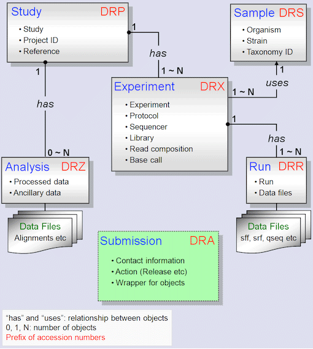
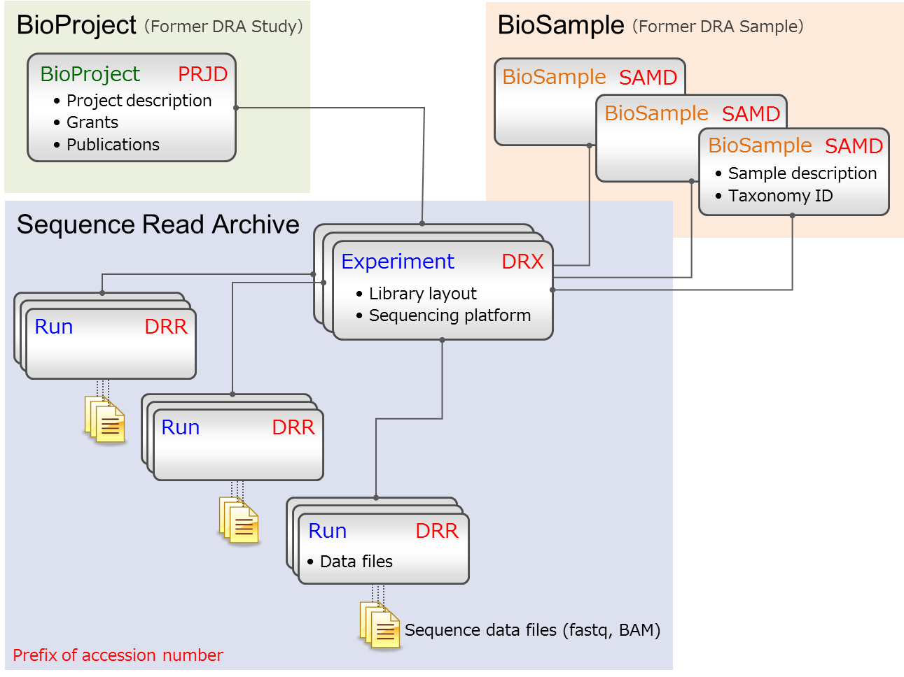

# NGS解析

## 目次
- [関連ツールのインストール](https://github.com/chalkless/lecture/blob/master/ngs/ngstools.md)
- NGS（次世代シーケンス解析）とは・原理とデータの入手：現状はこのページ。いずれ移す
- NGSデータの前処理：現状はこのページ。いずれ移す
- [トランスクリプトーム解析・その1：リードデータから発現値データまで（リードデータ → 関連データのダウンロード → マッピング → 発現値データ）](https://github.com/chalkless/lecture/blob/master/ngs/read2transcript.md)
- [トランスクリプトーム解析・その2：発現値データから差のある遺伝子セットの作成まで（実践編）（整理中）](https://github.com/chalkless/lecture/tree/master/biostats)
- [トランスクリプトーム解析・その3：差のある遺伝子セットの機能解析（整理中）](https://github.com/chalkless/lecture/blob/master/ngs/function4NGS.md)


## そもそもNGSとは
### その名前
* 次世代シーケンサー/新型シーケンサーと呼ばれるものです。
* 英語だとNext-generation Sequencing/New-generation Sequencingと呼ばれます。頭文字を取ってNGSです。
* 手法は～ Sequencing (Technology)、機械は ～ Sequencer
### 何が次世代/新型なのか
* 1990年代：ゲル板で電気泳動してシーケンスしていました
  * 自分の場合はLI-COR社（ライカ）製のシーケンサーに76cmのガラス板をセット。ポリアクリルアミドゲルに蛍光標識したダイデオキシヌクレオチド入りサンプルを入れて泳動
  * 参考：[DNAシークエンシング - Wikipedia -- 検出](http://ja.wikipedia.org/wiki/DNA%E3%82%B7%E3%83%BC%E3%82%AF%E3%82%A8%E3%83%B3%E3%82%B7%E3%83%B3%E3%82%B0#.E6.A4.9C.E5.87.BA)
  * 750～1500 bp × 48レーン / 4（=A/T/G/Cで各1レーン）≓ 12k bp
* 2000年代：キャピラリ（細いガラス管）でシーケンスしていました
  * 500bp×96レーン = 48k bp
* 2010年代：NGSが主流に
  * ダイデオキシ法（サンガー法）でなく、パイロシーケンシング法：「ヌクレオチドがDNAに取り込まれるときに放出されるピロリン酸をATPに変化させて発光反応に用いることで、ヌクレオチドがどれくらいDNAに取り込まれたかを定量できるという原理に基づいている。」（上記 Wikipediaより）
  * 1980年代から開発が始まり、1990年代後半になって実用化
  * 2（ペアエンド） × 300 bp × 18億（read）= 7200 億 bp（分）= 720,000,000 kbp
* 2020年代
  * パイロシーケンシング法以外の原理のシーケンサーも登場
  * 数百 bp を読む short read だけでなく、15,000 bp を読むlong read（ただしそこまで並列度は高くない）
  * 現在はshortとlongを組み合わせて読むのが主流に（ゲノム配列解読の場合）：リピート配列をまたぐようにlongでつなげてshortで精度を上げる
  * ↑ shortだと[Illumina社](https://jp.illumina.com/systems/sequencing-platforms.html)。longだと[PacBio社](https://www.pacb.com/japan/)。
* もうNGSが出て10年 経ってるけどまだ次世代とか? 新型とか?
  * 新大阪駅は60年（1964年～）。新京極通りは152年（1872年 [明治5年]）（2024年現在）
  * とはいえ、論文にnew/next-generationと書くともう古いだろうと言われることはある
    * massively parallel sequencing（大量並列シーケンシング）
    * high-throuphput DNA sequencing（高スループットDNAシーケンシング）
    * そのまま (NGS) と頭文字でないけど略語で通したり、also known as next-generation sequencing technology (NGS) と書いたりする。

## NGS解析の概要


## NGSデータの入手
### 主要な流れ
* データベースでデータを検索
* データのアクセッション番号を控える
* サイトからデータをダウンロード後にfasterq-dumpで展開 or データのアクセッション番号からfasterq-dumpで入手して展開

### 実際の検索
* NCBI（SRA: Sequence Read Archive）、EBI (ENA: European Nucleotide Archive)、DDBJ（DRA: DDBJ Sequence Read Archive）の3か所で収集・提供。これら3か所は互いのデータを交換し合っている。検索しやすいところで検索して番号を控えて別の場所からダウンロードしてもいい
 * [SRA](https://ncbi.nlm.nih.gov/sra)
 * [ENA](https://www.ebi.ac.uk/ena/browser/home)
 * [DRA](https://www.ddbj.nig.ac.jp/dra/index.html)

#### メタデータ構造の変遷 
* NGSデータの検索やリードデータのダウンロードの際はメタデータの構造を知っておくとよい
 * メタデータ＝メインのデータを説明するデータ。この場合はreadデータを説明する実験条件のデータ
 * 昔のバージョン（単純用）
  * 
  * DDBJのサイトより
 * 現在：StudyとSampleが外出しされてBioProjectとBioSampleになった（NGSデータから派生して発現データ[GEOに収録]やゲノム[GenBank Nucleotideに収録]も共通に管理するため）
  * 
  * https://www.ddbj.nig.ac.jp/dra/metadata.html より
 * 現在のもののさらなるイメージ図
  * 
#### データ構造
  * Study：プロジェクトの説明（例：菌株1000株読みますプロジェクト）、成果論文
  * Sample：各々のサンプルの説明：種名、株名、臓器名など
  * Experiment：各々のサンプルをシーケンシングした際の条件：single/pair end、シーケンサー名、ライブラリ試薬など
  * Run：リードデータそのものの説明。この下にリードデータがぶら下がる
  * Submission：登録データ：登録日など
  * Analysis：NGSデータを解析した場合のデータ


### fasterq-dump のインストール
* fastq-dumpやそれを高速化したfasterq-dumpはsra-toolkitとして配布されている
* Ubuntuの場合
```
$ sudo apt install sra-toolkit
$ fasterq-dump

Usage:
  fasterq-dump <path> [options]
  fasterq-dump <accession> [options]

Options:
  -F|--format                      format (special, fastq, default=fastq) 
  -o|--outfile                     output-file 
  -O|--outdir                      output-dir
  ...
（fasterq-dumpを実行して説明が表示されれば成功）
```
* Homebrewの場合
```
$ brew -v install sratoolkit
```

### NGSデータの配布形式
* NGSの（シーケンサーの出力する）生リード（raw read）のファイルの流通にはFASTQ形式のデータが使われる
```
@SRR6504026.1 MG00HS13:1487:H27KFBCX2:1:1101:1410:2249 length=101
CTCCGATATATAGGTCCCTCTGCCCCGCAGCGTTTCAATAATCCCCTCTCGCTCAAGCTCTTTATACGCTTTGCTGACAGTGTTCGGATTCGCAATAATGA
+SRR6504026.1 MG00HS13:1487:H27KFBCX2:1:1101:1410:2249 length=101
DDDDDIIIIHIIIHIIIIIGIIIIIIIIIIIIHHIIIIHIIIIIIHIIIIIIIIIHIGHIIHHIIIIIIIIIIIIIEHHIIIHIHHG=HHHEHHHIHIIHH
```

```
1行目：タイトル（@マークから始まる）
2行目：リードのシーケンス（塩基配列）
3行目：特に気にしなくていい（+マークから始まる）
4行目：リードのクオリティ
```

  * リードのシーケンスに対してクオリティがつくので、２行目と４行目が同じ長さになる
  * クオリティ：エラー率=10^(-Q/10)
    * Q=２0で1/100のエラー率で９９%のクオリティ。Q=30で1/1000のエラー率で９９．９％のクオリティ。
    * クオリティの値は2桁なので、それを文字に当てはめている。アルファベットだと32〜なので安心。
    * このあたりをビジュアル的に表す [fastqe](https://github.com/fastqe/fastqe) (fastq with emoji) というサービスもある。クオリティが悪いと渋い顔だったり火がついてたりする


* 下にあるようにファイルが数GBになるので、メタデータ（実験の説明データ）も含めて圧縮したSRA形式で配布もされる。最近はデータベースにはこちらの形式で置かれることが多い。


### データのダウンロードと展開

* シングルエンドとペアエンド

* fasterq-dump でファイルのダウンロードや展開（SRA形式→FASTQ形式）を行う
```
# ファイルのダウンロード
$ fasterq-dump SRR6504026
（データのダウンロードとSRA→FASTQの変換を一度に行う）

# ローカルにあるファイルの展開
$ fasterq-dump SRR6504026.sra
（データベースから自身でSRA形式ファイルをダウンロードして、それをfasterq-dumpの引数として指定）
（ダウンロードから行うと時間がかかったりするので、こちらの方が早いは早い）
```

### 実際のNGSデータを眺めてみる
```
$ ls -alFh        ←　hオプションをつけるとGB、MBのように人間が認識しやすいサイズで表示してくれる
合計 14G
drwxrwxr-x 2 chalkless chalkless 4.0K  1月 15 01:11 ./
drwxrwxr-x 3 chalkless chalkless 4.0K  1月 15 01:15 ../
-rw-rw-r-- 1 chalkless chalkless 1.9G 11月  4  2020 SRR6504026.sra         ←　展開前
-rw-rw-r-- 1 chalkless chalkless 5.9G  1月 15 01:11 SRR6504026_1.fastq     ←　展開後。サイズがかなり大きくなっている
-rw-rw-r-- 1 chalkless chalkless 5.9G  1月 15 01:11 SRR6504026_2.fastq     ←　ペアエンドなので_1 と _2　ができる。

$ wc -l SRR6504026_1.fastq 
71605624 SRR6504026_1.fastq      ←　7,160万行。実際のリード数はFASTQが4行で１セットなので 71605624/4 =　17901406 （1790万リード）
```

## クオリティチェック (optional)
* fastqcでチェックする
* この後の足切りプログラムをかける際に、クオリティチェックも同時にやってしまうソフトが多々あるので、ここでかける必要はない場合がある（が、ソフトはfastqcを使うのでインストールは必要）

### fastqcのインストール
```
# Ubuntuの場合
$ sudo apt install fastqc

# Homebrewの場合
$ brew -v install fastqc
```

### 実行例
```
$ fastqc --nogroup -o DRR1234567.fastq
```


## トリミング
* クオリティの悪いリードを除去したり、リード中のクオリティの低い部分を削ることをトリミングという
* trim-galoreはトリミングを行うソフトの１つである

### trim-galoreのインストール
```
# Ubuntuの場合
$ sudo apt install trim_galore
```

### 実行例
```
$ trim_galore --paired --illumina --fastqc -o trimmed/ DRR1234567.R1.fastq DRR1234567.R2.fastq
```


## その後の処理
* NGS実験を行った目的によって処理が変わっていく
  * [RNA-Seq（発現解析）](read2transcript.md)：ゲノムやcDNAにマッピングする。ゲノムやcDNAがない場合はde novo assemble（Readだけでtranscriptを構築）
  * SNP解析：ゲノムに精度良くマッピングして１塩基単位での変異を検出
  * ゲノム解析：つないでいく。Long readのデータとShort readのデータを組み合わせるのがトレンド
  * メタゲノム：つないでいく。株レベルの差異は無視して（バーチャルな）ゲノムに組み上げていくMAG(Metagenome Assembled Genome)がトレンド


